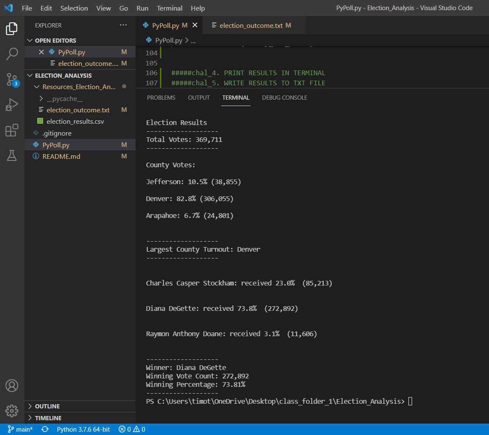

# Election_Analysis
Python Module 3

#### Notes on Python Code...
My code can be found in file: "PyPoll.py" in this repository.
The results of the analysis were written to a text file; that file is named election_outcome.txt and can be found in this repository, in the folder: Resources_Election_Analysis.

I did not use the same variable names throughout the code as were suggested by the Module work.  In most cases, my variable names are shorter, with abbreviations used.

I used Python 3.7.6 version. 
I used Visual Studio Code program to write my code.

## Overview of Election Audit 
The purposes of this election audit analysis was to find:
1. The total number of votes in the election.
2. The voter turnout for each county.
3. The percentage of total votes for each county
4. The county with the largest voter turnout.
5. The candidates in the election.
6. The number of votes for each candidate.
7. The percentage of total votes for each candidate.
8. The winning candidate.

## Election-Audit Results
1. 369'711 total votes were cast in this election.
2. Jefferson County had 38'855 votes cast.
Denver County had 306'055 votes cast.
Arapahoe County had 24'801 votes cast.
3. Jefferson County's votes were 10.5% of total votes.
Denver County's votes were 82.8% of total votes.
Arapahoe County's votes were 6.7% of total votes.
4. The county with the largest number of votes was Denver.
5. The candidates in this election were: Charles Casper Stockham, Diana DeGette and Raymon Anthony Doane.
6. Charles Casper Stockham received 85'213 votes, 
Diana DeGette received 272'892 votes,
Raymon Anthony Doane received 24'801 votes.
7. Charles Casper Stockham received 23% of total votes, 
Diana DeGette received 73.8% of total votes,
Raymon Anthony Doane received 3.1% of total votes.
8. Diana DeGette was the winning candidate, with 272'892 votes, 73.8% of the total votes.

## Election-Audit Summary
The script that I have written to get these elction results is robust and should be capable of re-use for other elections.  There may require slight modifications, if the future use case dataset is not in the same format.
1.  Given that a new dataset would come to us with a different filename than the filename of these data, line 8 of the code would have to be amended to show the name of the new file.
2.  Future Users would need to ensure that the new dataset was in ".csv" (comma seperated values) format.
3.  The future use case dataset would need to be inspected to ascertain the layout of the columns in the csv file.  If the same data came to our future User with the columns in a different order than our current dataset, we would need to modify code on lines: 49 and 68.
NB: if the new dataset had the columns in the same order - Ballot_#, County, Candidate - then this modification (3) would not be necessary.  
4.  Code on line 10 should be modified by any future Users, so that they can create a new text file for each subsequent usage.  If not, their future data would overwrite the data in the file election_outcomes.txt each time they used this script.

